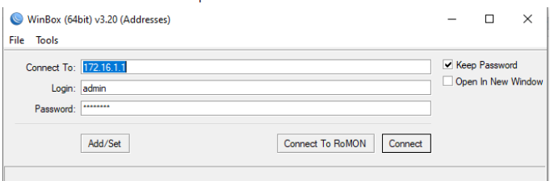
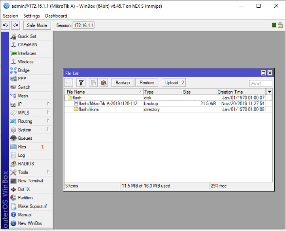

# Anisble-Smart-Industry
Microtik A Router
Backup file: router/MikroTik A-*.backup
Microtik B Router
Backup file: router/MikroTik B-*.backup

MikroTik routers backup process:

To create a backup on the MikroTik routers use this line in the terminal: /system backup save
This line will create a backup file which you can download

Use WinBox to transfer the backup to or from the router.

First type in the ip of the router, and log in with and admin account.

After logging in go to files.

As you can see in the image above there is a file called flash/MikroTik. This is a backup file, right click on this and select download to save this to your own pc.

To upload a backup, select the upload button, and select the file you want to upload to the router.
To restore the router to the backup, right click the back up and select restore.

Revpi A
Backup files: 
	cert.der
	OPCUAServerSecured.py
	private.pem
state.py
	trafic_light.py
Ansible playbook: ansible-playbook revpi-a.yml -i hosts --ask-pass -u=pi

Raspberry A
backup file: index.html
Ansible playbook: ansible-playbook raspberry-a.yml -i hosts --ask-pass -u=pi

Raspberry B
backup file: index.html
Ansible playbook: ansible-playbook raspberry-b.yml -i hosts --ask-pass -u=pi
